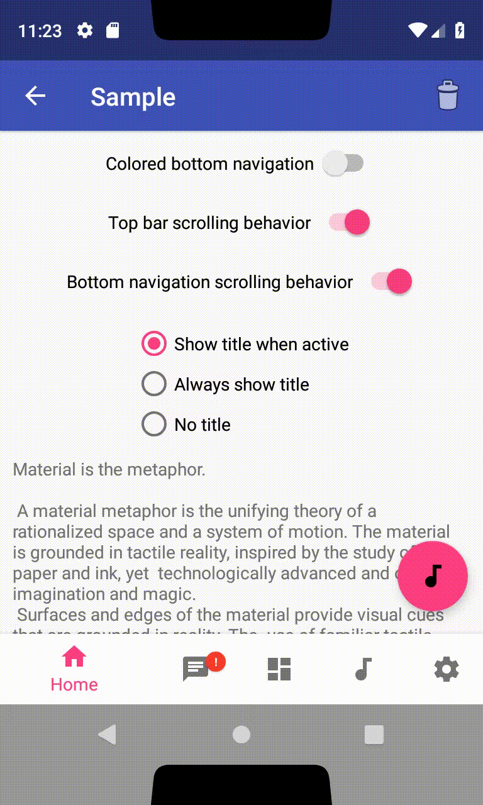
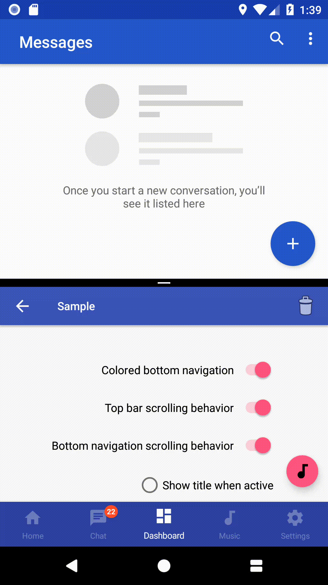
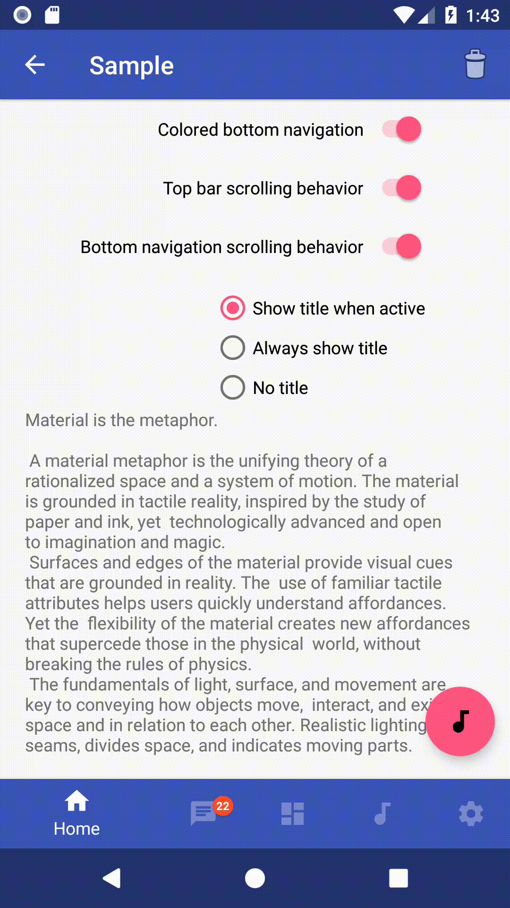

[  ](https://bintray.com/afflya/afflyasnavigation/afflyasnavigation-kotlin/_latestVersion)

# AfflyasNavigation

AfflyasNavigation is an Android library for implementing the behavior of navigation components upon content scrolling

## Sample

    

## What's new in 1.0.1 ([Changelog](https://github.com/Afflya/afflyasnavigation/master/ChangeLog.md))

* Updated libraries versions
* Optimized screen bounds calculation algorithm

## Configuration

- compileSdkVersion=27
- minSdkVersion=14
- targetSdkVersion=27
- supportVersion=27.1.1
- kotlinVersion=1.2.41

## Components

### ANTopBar

* Container for the content displayed at the top of the screen such as `Toolbar`
* Appear and disappear upon scrolling synchronously within `ANBottomNavigation`
* Top padding depends on the availability of transparent navigation, as well as the position of the window in multi-window mode

### ANBottomNavigation

* Folllowing the [bottom navigation guidelines](https://www.google.com/design/spec/components/bottom-navigation.html) from Material Design
* Add 3 to 5 items (with title, icon & color)
* 3 different navigation styles
* Manage notififcations for each item
* Adapted to multi-window mode
* Adapted to translucent navigation
* Proper Snackbar behavior

### ANFloatingActionButton

* Attaches to top of `ANBottomNavigation`
* Moves up when `Snackbar` appears
* Always above translucent navigation bar
* Adapted to side translucent navigation in landscape orientation

## Getting started

### Installation

Add the following line to your `build.gradle`'s dependencies section:

```groovy
implementation 'com.github.afflya:afflyasnavigation-kotlin:1.0.1'
```

* The library is completely written in [Kotlin](https://kotlinlang.org) but will work if you use java

### Usage

#### Via XML 

```xml
<?xml version="1.0" encoding="utf-8"?>
<android.support.design.widget.CoordinatorLayout xmlns:android="http://schemas.android.com/apk/res/android"
    xmlns:app="http://schemas.android.com/apk/res-auto"
    xmlns:tools="http://schemas.android.com/tools"
    android:id="@+id/coordinator"
    android:layout_width="match_parent"
    android:layout_height="match_parent"
    tools:context="com.afflyas.sample.MainActivity">

    <com.afflyas.afflyasnavigation.ANTopBar
        android:id="@+id/appBar"
        android:layout_width="match_parent"
        android:layout_height="wrap_content"
        android:layout_gravity="top"
        app:tbBehaviorTranslationEnabled="true"
        android:background="@color/colorPrimary"
        android:theme="@style/AppTheme.AppBarOverlay">
                
        <!--Add content to your top bar here. For example, add a toolbar-->
        <android.support.v7.widget.Toolbar
            android:id="@+id/toolbar"
            android:layout_width="match_parent"
            android:layout_height="?attr/actionBarSize"
            app:popupTheme="@style/AppTheme.PopupOverlay" />

    </com.afflyas.afflyasnavigation.ANTopBar>

    <com.afflyas.afflyasnavigation.ANFloatingActionButton
        android:id="@+id/fab"
        android:layout_width="wrap_content"
        android:layout_height="wrap_content"
        android:layout_gravity="bottom|end"
        app:srcCompat="@drawable/ic_audiotrack_black_24dp"
        app:useCompatPadding="true" />

    <com.afflyas.afflyasnavigation.ANBottomNavigation
        android:id="@+id/bottomNavigation"
        android:layout_width="match_parent"
        android:layout_height="wrap_content"
        android:layout_gravity="bottom"/>

    <!--Other content-->

</android.support.design.widget.CoordinatorLayout>
```

#### Bottom navigation bar

```kotlin
// Create items
val item1 = ANBottomNavigationItem(R.string.home, R.drawable.ic_home, R.color.colorPrimary)
val item2 = ANBottomNavigationItem(R.string.chat, R.drawable.ic_chat, R.color.colorAccent)
val item3 = ANBottomNavigationItem(R.string.dashboard, R.drawable.ic_dashboard, R.color.colorPrimaryDark)
val item4 = ANBottomNavigationItem(R.string.music, R.drawable.ic_audiotrack, android.R.color.holo_red_light)
val item5 = ANBottomNavigationItem(R.string.settings, R.drawable.ic_settings, android.R.color.holo_green_light)

// Add items
bottomNavigation.addItem(item1)
bottomNavigation.addItem(item2)
bottomNavigation.addItem(item3)
bottomNavigation.addItem(item4)
bottomNavigation.addItem(item5)

// Set background color
bottomNavigation.setDefaultBackgroundColor(Color.parseColor("#FEFEFE"));

// Enable the translation inside the CoordinatorLayout
bottomNavigation.setBehaviorTranslationEnabled(true);

// Manage titles
bottomNavigation.setTitleState(AHBottomNavigation.TitleState.SHOW_WHEN_ACTIVE);
bottomNavigation.setTitleState(AHBottomNavigation.TitleState.ALWAYS_SHOW);
bottomNavigation.setTitleState(AHBottomNavigation.TitleState.ALWAYS_HIDE);

// Change colors
bottomNavigation.setAccentColor(Color.parseColor("#F63D2B"));
bottomNavigation.setInactiveColor(Color.parseColor("#747474"));

// Force to tint the drawable (useful for font with icon for example)
bottomNavigation.setForceTint(true);

// Use colored navigation with circle reveal effect
bottomNavigation.setColored(true);

// Set current item programmatically
bottomNavigation.setCurrentItem(1);

// Customize notification (title, background, typeface)
bottomNavigation.setNotificationBackgroundColor(Color.parseColor("#F63D2B"));

// Add notification for each item
bottomNavigation.setNotification("1", 3);
// OR
val notification = ANNotification.Builder()
	.setText("1")
	.setBackgroundColor(ContextCompat.getColor(this, R.color.color_notification_back))
	.setTextColor(ContextCompat.getColor(this, R.color.color_notification_text))
	.build()
bottomNavigation.setNotification(notification, 1)

// Remove notification for each item
bottomNavigation.setNotification("", 3);

// Enable / disable item & set disable color
bottomNavigation.enableItemAtPosition(2);
bottomNavigation.disableItemAtPosition(2);
bottomNavigation.setItemDisableColor(Color.parseColor("#3A000000"));

// Set listener
bottomNavigation.setOnTabSelectedListener(object : ANBottomNavigation.OnTabSelectedListener {
            override fun onTabSelected(position: Int, wasSelected: Boolean): Boolean {
                when(position){
                    1 -> {
                        bottomNavigation.setNotification("", 1)
                        bottomNavigation.setNotification(" ", 2)
                    }
                    2 -> {
                        bottomNavigation.setNotification("22", 1)
                        bottomNavigation.setNotification("", 2)
                    }
                }
                return true
            }
        })
```

#### Translucent navigation

The elements automatically adapt to transparent bars, you just need to include these lines in your application's theme


```xml
<style name="AppTheme.TranslucentNavigation" parent="AppTheme">
        <item name="android:windowTranslucentNavigation">true</item>
        <item name="android:windowTranslucentStatus">true</item>
</style>
```

* Add these lines to ``styles-v21`` if your minSdkVersion<21

## Current tasks

* Upgrade ANFloatingActionButton translation behavior for Gravity.TOP (move FAB to top) and Gravity.CENTER_VERTICAL (do not move)
* Add bottom translation for large screens (when little snackbar appears in the middle)
* Add content container component

## License

```
Copyright (c) 2018 Andrey Poznyakov (https://github.com/Afflya).

Licensed under the Apache License, Version 2.0 (the "License");
you may not use this file except in compliance with the License.
You may obtain a copy of the License at

http://www.apache.org/licenses/LICENSE-2.0

Unless required by applicable law or agreed to in writing, software
distributed under the License is distributed on an "AS IS" BASIS,
WITHOUT WARRANTIES OR CONDITIONS OF ANY KIND, either express or implied.
See the License for the specific language governing permissions and
limitations under the License.
```

