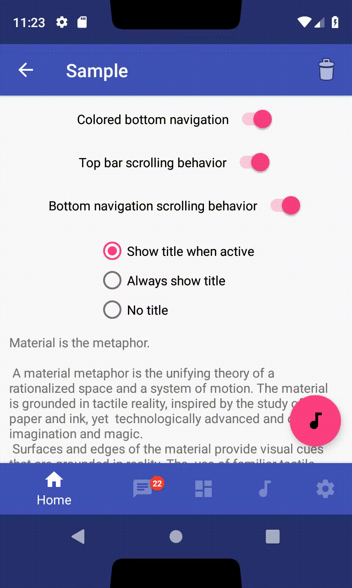

[  ](https://bintray.com/afflya/afflyasnavigation/afflyasnavigation-kotlin/_latestVersion)

# AfflyasNavigation

AfflyasNavigation is an Android library for implementing the behavior of navigation components upon content scrolling

## Sample

    

## What's new in 1.1.0 ([Changelog](https://github.com/Afflya/afflyasnavigation/blob/master/Changelog.md))

* Migrated to SDK 28 and AndroidX libraries
* Added display cutout support for devices running android P
* New container layout that helps to avoid display cutout at the side of the screen (ANVerticalContentContainer)
* New layouts to help to avoid translucent status and navigation bars (ANSpaceBottom and ANSpaceTop)
* Added new XML attributes for all elements
* Now you can create bottom navigation items using XML resouce

## Configuration

- compileSdkVersion=28
- minSdkVersion=14
- targetSdkVersion=28
- androidXVersion=1.0.0-rc01
- kotlinVersion=1.2.60

## Components

### ANTopBar

* Container for the content displayed at the top of the screen such as `Toolbar`
* Appear and disappear upon scrolling synchronously within `ANBottomNavigation`
* Top padding depends on the availability of transparent navigation, as well as the position of the window in multi-window mode

### ANBottomNavigation

* Folllowing the [bottom navigation guidelines](https://www.google.com/design/spec/components/bottom-navigation.html) from Material Design
* Add 3 to 5 items (with title, icon & color)
* 3 different navigation styles
* Manage notififcations for each item
* Adapted to multi-window mode
* Adapted to translucent navigation
* Proper Snackbar behavior

### ANFloatingActionButton

* Attaches to top of `ANBottomNavigation`
* Moves up when `Snackbar` appears
* Always above translucent navigation bar
* Adapted to side translucent navigation in landscape orientation

### ANVerticalContentContainer

* Container to your content that helps to avoid translucent navigation bar and display cutout on the side of the screen

### ANSpaceTop and ANSpaceBottom

* Space on top and bottom of your scrolling content avoid translucent navigation bar, status bar and display cutout

## Getting started

### Installation

Add the following line to your `build.gradle`'s dependencies section:

```groovy
implementation 'com.github.afflya:afflyasnavigation-kotlin:1.1.0'
```

* The library is completely written in [Kotlin](https://kotlinlang.org) but will work if you use java

### Usage

#### Via XML 

```xml
<?xml version="1.0" encoding="utf-8"?>
<androidx.coordinatorlayout.widget.CoordinatorLayout android:id="@+id/coordinator"
    android:layout_width="match_parent"
    android:layout_height="match_parent"
    tools:context="com.afflyas.sample.MainActivity"
    xmlns:android="http://schemas.android.com/apk/res/android"
    xmlns:tools="http://schemas.android.com/tools"
    xmlns:app="http://schemas.android.com/apk/res-auto"

    <com.afflyas.afflyasnavigation.ANTopBar
        android:id="@+id/app_bar"
        android:layout_width="match_parent"
        android:layout_height="wrap_content"
        android:layout_gravity="top"
        app:behaviorTranslationEnabled="true"
        android:background="@color/colorPrimary"
        android:theme="@style/AppTheme.AppBarOverlay">
                
        <!--Add content to your top bar here. For example, add a toolbar-->
        <android.support.v7.widget.Toolbar
            android:id="@+id/toolbar"
            android:layout_width="match_parent"
            android:layout_height="?attr/actionBarSize"
            app:popupTheme="@style/AppTheme.PopupOverlay" />

    </com.afflyas.afflyasnavigation.ANTopBar>

    <com.afflyas.afflyasnavigation.ANFloatingActionButton
        android:id="@+id/floating_action_button"
        android:layout_width="wrap_content"
        android:layout_height="wrap_content"
        android:layout_gravity="bottom|end"
        app:srcCompat="@drawable/ic_audiotrack_black_24dp"
        app:useCompatPadding="true"
        app:withANBottomNavigation="true"/>

    <com.afflyas.afflyasnavigation.ANBottomNavigation
        android:id="@+id/botNav"
        android:layout_width="match_parent"
        android:layout_height="wrap_content"
        app:behaviorTranslationEnabled="true"
        app:colored="true"
        app:titleState="always_show"
        app:itemsMenu="@xml/bot_nav_menu"
        android:layout_gravity="bottom"/>

    <!--Layout to avoid translucent navigation bar and display cutout on the sides-->
    <com.afflyas.afflyasnavigation.ANVerticalContentContainer
        android:layout_width="match_parent"
        android:layout_height="match_parent">

        <androidx.core.widget.NestedScrollView
            android:id="@+id/nestedScrollView"
            android:layout_width="match_parent"
            android:layout_height="match_parent">

            <LinearLayout
                android:layout_width="match_parent"
                android:layout_height="wrap_content"
                android:orientation="vertical">

                <!--Space before content to avoid status bar and display cutout-->
                <com.afflyas.afflyasnavigation.ANSpaceTop
                    android:layout_width="match_parent"
                    android:layout_height="wrap_content"
                    app:topBarHeightMode="default_action_bar"/>

                <!--Place your content here-->
                
                <!--Space after the content to avoid navigation and display cutout-->
                <com.afflyas.afflyasnavigation.ANSpaceBottom
                    android:layout_width="match_parent"
                    android:layout_height="wrap_content"
                    app:withANBottomNavigation="true"/>

            </LinearLayout>

        </androidx.core.widget.NestedScrollView>

    </com.afflyas.afflyasnavigation.ANVerticalContentContainer>

</android.support.design.widget.CoordinatorLayout>
```

#### Bottom navigation bar

```kotlin
// Create items
val item1 = ANBottomNavigationItem(R.string.home, R.drawable.ic_home, R.color.colorPrimary)
val item2 = ANBottomNavigationItem(R.string.chat, R.drawable.ic_chat, R.color.colorAccent)
val item3 = ANBottomNavigationItem(R.string.dashboard, R.drawable.ic_dashboard, R.color.colorPrimaryDark)
val item4 = ANBottomNavigationItem(R.string.music, R.drawable.ic_audiotrack, android.R.color.holo_red_light)
val item5 = ANBottomNavigationItem(R.string.settings, R.drawable.ic_settings, android.R.color.holo_green_light)

// Add items
bottomNavigation.addItem(item1)
bottomNavigation.addItem(item2)
bottomNavigation.addItem(item3)
bottomNavigation.addItem(item4)
bottomNavigation.addItem(item5)

// Set background color
bottomNavigation.setDefaultBackgroundColor(Color.parseColor("#FEFEFE"));

// Enable the translation inside the CoordinatorLayout
bottomNavigation.setBehaviorTranslationEnabled(true);

// Manage titles
bottomNavigation.setTitleState(AHBottomNavigation.TitleState.SHOW_WHEN_ACTIVE);
bottomNavigation.setTitleState(AHBottomNavigation.TitleState.ALWAYS_SHOW);
bottomNavigation.setTitleState(AHBottomNavigation.TitleState.ALWAYS_HIDE);

// Change colors
bottomNavigation.setAccentColor(Color.parseColor("#F63D2B"));
bottomNavigation.setInactiveColor(Color.parseColor("#747474"));

// Force to tint the drawable (useful for font with icon for example)
bottomNavigation.setForceTint(true);

// Use colored navigation with circle reveal effect
bottomNavigation.setColored(true);

// Set current item programmatically
bottomNavigation.setCurrentItem(1);

// Customize notification (title, background, typeface)
bottomNavigation.setNotificationBackgroundColor(Color.parseColor("#F63D2B"));

// Add notification for each item
bottomNavigation.setNotification("1", 3);
// OR
val notification = ANNotification.Builder()
	.setText("1")
	.setBackgroundColor(ContextCompat.getColor(this, R.color.color_notification_back))
	.setTextColor(ContextCompat.getColor(this, R.color.color_notification_text))
	.build()
bottomNavigation.setNotification(notification, 1)

// Remove notification for each item
bottomNavigation.setNotification("", 3);

// Enable / disable item & set disable color
bottomNavigation.enableItemAtPosition(2);
bottomNavigation.disableItemAtPosition(2);
bottomNavigation.setItemDisableColor(Color.parseColor("#3A000000"));

// Set listener
bottomNavigation.setOnTabSelectedListener(object : ANBottomNavigation.OnTabSelectedListener {
            override fun onTabSelected(position: Int, wasSelected: Boolean): Boolean {
                when(position){
                    1 -> {
                        bottomNavigation.setNotification("", 1)
                        bottomNavigation.setNotification(" ", 2)
                    }
                    2 -> {
                        bottomNavigation.setNotification("22", 1)
                        bottomNavigation.setNotification("", 2)
                    }
                }
                return true
            }
        })
```

#### Items using xml menu

* Create resource file in `res/xml` like this

```xml
<menu xmlns:android="http://schemas.android.com/apk/res/android">
    <item
        android:title="@string/home"
        android:icon="@drawable/ic_home_black_24dp"
        android:color="@color/colorPrimary"/>
    <item
        android:title="@string/chat"
        android:icon="@drawable/ic_chat_black_24dp"
        android:color="@color/colorAccent"/>
    <item
        android:title="@string/dashboard"
        android:icon="@drawable/ic_dashboard_black_24dp"
        android:color="@color/colorPrimaryDark"/>
    <item
        android:title="@string/music"
        android:icon="@drawable/ic_audiotrack_black_24dp"
        android:color="@android:color/holo_red_light"/>
    <item
        android:title="@string/settings"
        android:icon="@drawable/ic_settings_black_24dp"
        android:color="@android:color/holo_green_light"/>
</menu>
```

* Add `app:itemsMenu="@xml/bot_nav_menu"` attribute with the path to the file to your `ANBottomNavigation`

#### Translucent navigation

The elements automatically adapt to transparent bars, you just need to include these lines in your application's theme


```xml
<style name="AppTheme.TranslucentNavigation" parent="AppTheme">
        <item name="android:windowTranslucentNavigation">true</item>
        <item name="android:windowTranslucentStatus">true</item>
</style>
```

* Add these lines to ``styles-v21`` if your minSdkVersion<21

## License

```
Copyright (c) 2018 Andrey Poznyakov (https://github.com/Afflya).

Licensed under the Apache License, Version 2.0 (the "License");
you may not use this file except in compliance with the License.
You may obtain a copy of the License at

http://www.apache.org/licenses/LICENSE-2.0

Unless required by applicable law or agreed to in writing, software
distributed under the License is distributed on an "AS IS" BASIS,
WITHOUT WARRANTIES OR CONDITIONS OF ANY KIND, either express or implied.
See the License for the specific language governing permissions and
limitations under the License.
```

